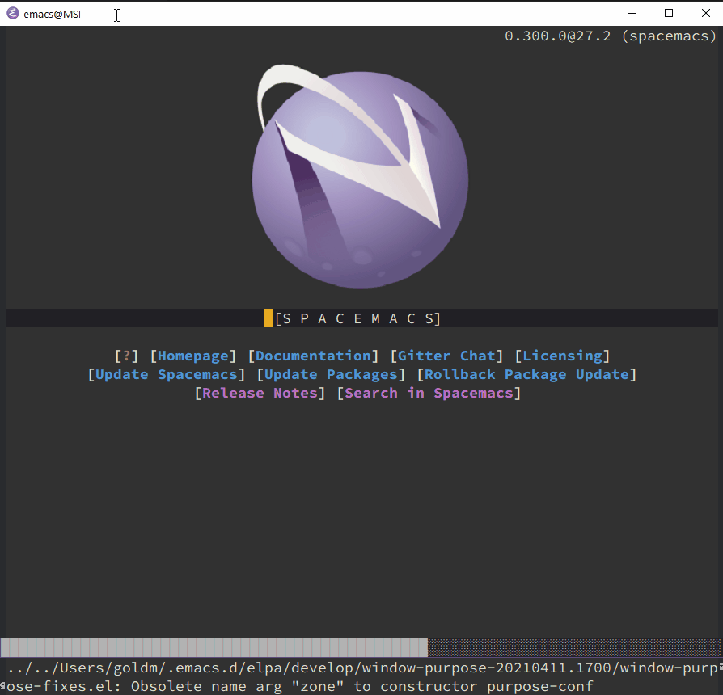

# Spacemacs Windows Installer


## Installation
``` shell
pip install -r requirements.txt
python ./install_spacemacs
```
**note** you will need to accept the prompt to run python.exe as administrator to install Emacs and the Source Code Pro fonts

## What this script does

-   Downloads and installs Emacs for Windows 27.2-x86_64.exe from the official installer distribution
-   Installs a site-start.el script which uses `%userprofile%/` as the home directory
-   Installs my `.spacemacs` config
-   Clones the spacemacs github repo into `%userprofile%/.emacs.d/`
-   Downloads and installs the Source Code Pro fonts
